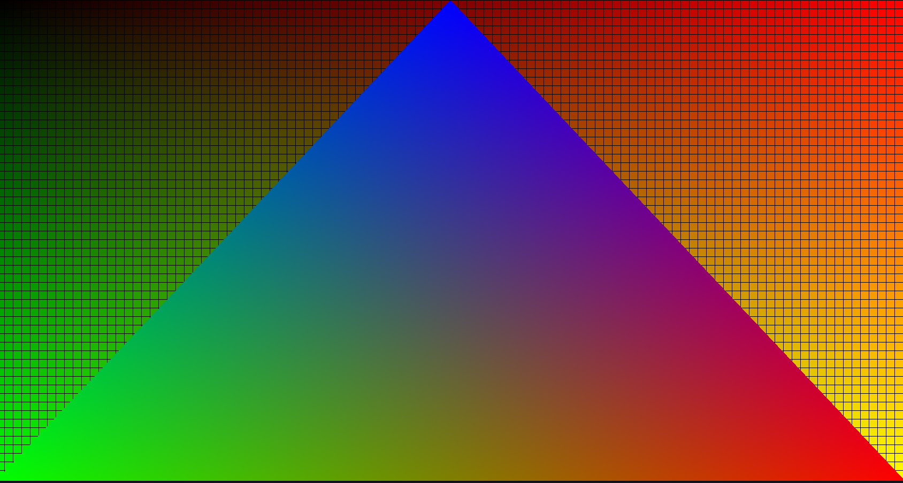

# Project Bulldog

### Overview
- The current project is broken up into 3 main parts
1. third_party directory
    - This contains all third party libraries that are included or built from source. At time of writing this is:
        - fastgltf -> gltf loading
        - fmt -> string formatting, used for logginng
        - glm -> math library, rendering usages
        - imgui -> Dear IMGUI debug window library
        - nlohmann -> JSON parsing
        - SDL -> handles windowing and input handling. Will use audio features down the road
        - stb_image -> image loading
        - vkbootstrap -> helper library for initializing vulkan
        - volk -> vulkan helper library
    - Vulkan, notably, is not listed here, as the Vulkan SDK/drivers must be installed in the system. This is hopefully something I will include already in any prebuilt binaries I produce
2. orion directory
    - This contains the source code for the underlying engine. I chose the name Orion after the submarine USS Orion my grandpa was a CO of during his service in the Navy
    - The center of this is an entry.h file, which for now, defines the following:
    ```cpp
    extern void init();

    extern void run();

    ```
    Program execution then follows:
    ```cpp
    int main(){
    ...
    init();
    ...
    run();
    ...
    }
    ```
    - Rather than hardcoding a execution flow, the goal is a config/data driven execution and an inversion of control
    - Scenes, assets, textures/materials and so on will be defined outside of the program and loaded at runtime to dictate execution
3. Sandbox
    - This contains the demo project I will use as a testbed for new features. Right now it is fairly empty, and mainly serves to validate the build and execution process.
    - Next major commit should contain the scene declaration and running, which will be showcased here

### Renderer overview
- Current renderer support is limited, as the engine refactor is not-yet complete. Previous commits and other branches contain much more functional rendering of a full GLB file with material support:

> Screenshot captured in-engine
- Currently, a compute shader execution to set a background is supported, and a primitive graphics pipeline (mesh loading is next to be implemented);
- Proper named renderpasses in vulkan are not used. As of Vulkan 1.3, dynamic rendering is supported, which is what I am using
    - Current draw process psuedo code is as follows:
    ```
    run(){
    gameDefinedTick();
    engineUpdate(); // Physics updates, input handling, etc. 

    // Render specific steps
    
    drawImage = allocateImage(); // An image is requested from the swapchain to support better draw resolution. This will be transitioned into the required formats for each draw step
    transitionImage(drawImage); // Transition for drawing into
    runComputeBackground(drawImage); // Compute background is first drawn 
    for(object in drawableObjects) {  // Objects are sorted based on required pipelines to optimizing un-neccessary rebinds of pipelines
        objectDraw(drawImage);
    }
    transitionImage(drawImage); // Transition for presenting
    copyImage(drawImage, presentImage);
    swapchainPresentImage(presentImage);
    }
    ```
    - We do not declare a dedicated 'renderpass' and instead use our own image to draw into along the way. This will help down the road for better postprocess effects.
    

### Engine API
- A proper API is not yet available. As the previous version of the project was a rather hardcoded scene render from a GLB file, there is a good chunk of outstanding work to shift it to a more proper API. 
- This section will be updated as progress is made
#### Utils
- Logging macro OE_LOG
    ```cpp
    // First declare a log group
    DECLARE_LOG_CATEGORY(DEMO_CATEGORY)
    // Using the log macro
    OE_LOG(LOG_GROUP, SEVERITY, "format string {}", "format string arg");
    ```
    - It uses fmt under the hood for fstring, so use {} as the identifier. This should raise compiler errors if improperly formatted as such
    - By default, TRACE severity logs are not output. This means by default, any trace logs used in engine intialization will not be produced. I believe this is fine, and they can be turned on for finer debugging.
    - It can be changed by modifying this line in orion/util/logger.hpp:
        ```cpp
        Logger() : minVerbosity_(LOG_LEVEL::INFO) {}
         ```
        however I am intending to move this to configuration file rather than needing to recompile a header
    - Alternatively, you can call this:
    ```cpp
    Logger::Get().SetMinVerbosity(LOG_LEVEL verbosity);
    ```


### Feature roadmap
- [x] Build system revamp
- [x] scene graph declaration 
    - Initial background declaration done
    - Scenes directory will contain this. There is a very primitive scene that points to the compute shader to be used as the background, with a 'hello triangle' graphics pipeline. It should look something like this:
 
    - Further progress will have object, mesh files, script referencing, materials, and so on, that is assembled into a scene graph.
- [ ] ECS/Actor system 
    - The aim is an OOP driven class sytem:
        - Nodes in the scene graph can be labeled with an actor name
        - That actor class is then loaded as part of the graph creation, and any components
        - Futher components on that node can be attached different actors, or components
        - This is pulling a lot of inspiration fromm Unreal Engine's system, which I am quite a fan of
- [ ] Physics system
    - At minimum, giving actors the ability to move around and a basic collision system. 
- [ ] Audio
- [ ] PBR Material support
    - Better material support since previous status included GLB loading. 
- [ ] Rendering improvements
    - This will be a continual area of effort. There are a LOT of things I want to work with.
        - Deferred rendering. Likely first candidate
        - Hybrid rendering, as a followup to deferred rendering, for adding real-time raytracing for the finer effects, reflections and more. Using this [blogpost](https://www.gamedev.net/projects/380-real-time-hybrid-rasterization-raytracing-engine/) as a reference point for desired functionality.
        - GPU driven/compute based rendering, especially for instanced objects
        - Proper lighting. I was contemplating starting with shadowmaps, however given my plan for hybrid rendering I may jump straight to ray-traced shadows
- [ ] Multi-API graphics
    - Vulkan was the first choice as a) I develop on linux and b) it's cross platform already to my other windows machine
        - As of [9c1d1ad](https://github.com/mmorgan00/ProjectBulldog/commit/9c1d1ade00d5fd01d00b8154a1914d967b91971d), render module supports a backend abstraction from rest of the app
        - Currently only supports Vulkan, however has the foundation to support other APIs.
    - [ ] DirectX
    - [ ] OpenGL -> for if I want to support older devices that don't support vulkan 1.3
    - [ ] Metal -> Apple support is something I would like to do at some point, but is not a priority

### Building and running the demo
- My current build process relies on CMake

#### Linux
```bash
# Clone repo
git clone git@github.com:mmorgan00/ProjectBulldog.git
cd ProjectBulldog
# Build
cmake -S ./ -B ./build
cd build
cmake --build .
# Execute Demo program
./orion/demo
```

#### Windows
- Coming soon

#### Mac
- A very long way down the road. At some point I'll investigate, but this is not something I anticipate happening for a while
